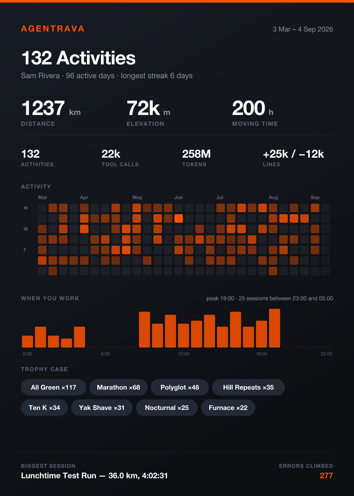

# Agentrava

Strava, for coding agents. An MCP server that turns a finished session into a
bragging card — route map, climb profile, headline stats, badges, personal records.

<p align="center">
  
  
</p>
<p align="center"><em>One session · a whole season. Both examples are synthetic — no real usage data ships in this repo.</em></p>

**Nothing on a card is self-reported.** A hook parses the session transcript for
tool calls, tokens, diff hunks, recovered errors and moving time. The agent never
gets to describe its own workout. Works with Claude Code and Cursor.

## Install

```bash
git clone https://github.com/lukisimi/agentrava ~/agentrava && cd ~/agentrava
npm run setup
```

Installs dependencies, registers the MCP server at user scope, and adds the Stop
hook. Idempotent, backs up every file it edits, and reversible:

```bash
npm run setup -- --manual      # keep the tools, stop logging every turn
npm run setup -- --auto        # put automatic logging back
npm run setup -- --cursor      # also install the Cursor probe
npm run setup -- --uninstall   # remove everything (your data is left alone)
```

Restart Claude Code, then `node scripts/backfill.mjs` to log your history.

Any MCP client works — it speaks stdio:

```json
{ "mcpServers": { "agentrava": { "command": "node", "args": ["/path/to/agentrava/src/index.js"] } } }
```

## Tools

- **`snapshot`** — card for the session in progress, measured from the live transcript.
- **`log_activity`** — log a session by hand; unreported fields count as zero.
- **`recap`** — one card for a whole period: totals, activity heatmap, hour-of-day
  histogram, trophy case, longest streak, biggest session. Optional `from` / `to`.
- **`get_profile`** — career totals, streak, personal records, trophy case.
- **`list_activities`** · **`leaderboard`** · **`set_athlete`**

## The metaphor

| Strava | Agentrava | Formula |
|---|---|---|
| Distance | ground covered | `churn / 100 + tool_calls / 25` km |
| Elevation | the parts that hurt | `files × 37 + errors × 120 + tests_failed × 45` m |
| Moving time | session time, idle excluded | gaps over 5 min don't count |
| Pace | minutes per km | `time / distance` |
| Suffer score | Effort, 0–100 | cadence, elevation, tokens, retries |
| Calories | tokens burned | input + cache writes + output |
| Economy | tokens per km | lower is leaner |
| Gear | the model | measured, never assumed |
| — | API cost | priced per message at list rates |

Every weight is **fitted to real sessions**, not guessed. Churn alone left the
median session at 0.00 km — most sessions read and search far more than they
write — which is why tool calls carry distance too.

## What the numbers actually mean

The inputs are measured. The **scales are invented** — 100 lines = 1 km, an error
= 120 m — chosen so a median session lands near a plausible 4.4 km. That makes
cards comparable **between your own sessions**, which is what records and the
leaderboard rest on, and meaningless outside Agentrava.

Measured across 134 sessions:

| | correlates most with | r |
|---|---|---|
| Distance | tool calls | **0.94** |
| Distance | churn | 0.86 |
| Elevation | errors recovered | **0.91** |
| Elevation | files changed | 0.88 |

So distance is *volume of activity* — 69% of it from the tool-call term — and
elevation is *friction*, 58% of it from errors. They correlate 0.79 with each
other: overlapping, but about a third of elevation is information distance
doesn't carry, which is what separates a long easy session from a short brutal one.

**Raw tokens cannot rank efficiency.** They correlate 0.72 with distance, so the
number mostly says how big a session was. Economy (tokens per km) correlates 0.08
with distance — size-independent, and therefore actually comparable. It measures
token cost per unit of *volume*, not of *value*: a session that finds the right
answer in five calls scores badly on it.

**None of this measures whether the work was any good.** A session that flails for
800 tool calls outscores one that fixes the bug in five. Nothing in a transcript
reliably encodes outcome — that's a ceiling, not a tuning problem.

## The route and the climb profile

**The route map** is a random walk seeded by the activity id, so a card always
redraws identically. Two things in it are real: its length and density come from
tool calls, and **every error you recovered from draws as a loop** — the trace
shows where you went in circles.

**The climb profile** under it is cumulative elevation: flat where the session ran
smoothly, stepping up wherever a file was written or an error recovered, bucketed
by moving time so an idle gap doesn't collapse it. The area under the curve is the
elevation figure on the card.

That strip was decoration until recently — a seeded random walk reading no session
data at all, the same label over pure noise. Sessions with fewer than three climb
events now get **no strip at all** rather than an invented one. 81% have a profile.

## Badges

Earnable, not participation trophies:

`Negative Splits` deleted more than you wrote · `Flawless` no errors, no failed tests ·
`Hill Repeats` climbed out of it 3+ times · `Marathon` 1h+ · `Ultra` 3h+ ·
`Sprint` under 3 minutes with a diff · `Yak Shave` 30+ tool calls, barely a diff ·
`All Green` full suite, zero red · `Furnace` 5M+ tokens · `Nocturnal` 11pm–5am ·
`Everest` 3000m+ · `10K Club` 10 km · `Gran Fondo` 40 km · `Polyglot` 3+ languages ·
`Red Zone` effort 90+ · `Sightseeing` all reading, no writing ·
`Signed Off` 10+ edits accepted, none sent back (Cursor only)

Measured frequency: `Hill Repeats` 47%, `Marathon` 44%, `Yak Shave` 36%,
`Polyglot` 31%, `10K Club` 25%, `Ultra` 22%, `Flawless` 22%, `Nocturnal` 19%,
`Red Zone` 14%, `Furnace` 8%, `Everest` 8%. Average 3.1 badges per card.

Personal records only fire once there is something to beat, so the first activity
never claims one.

## Logging

Three modes, in descending cost:

| | per-turn cost | logs sessions | keeps streaks honest |
|---|---|---|---|
| **auto** (Stop hook) | ~300 ms | automatically | yes |
| **manual + day stamp** (default of `--manual`) | ~10 ms | when you ask | yes |
| **manual only** (`--manual --no-stamp`) | none | when you ask | no |

The full hook re-parses the transcript and redraws the card every turn. The day
stamp is a two-line shell script that appends today's date and nothing else — it
never starts a Node process, and writes one line per *day*. Streaks count the
union of logged-activity days and stamped days, so both modes mean the same thing.

By hand, any time:

```bash
npm run log                       # the session you are in
node scripts/log-now.mjs --cursor # the Cursor conversation you are in
node scripts/log-now.mjs --list   # 15 most recent, newest first
node scripts/log-now.mjs 9e22ccfa # one session by id prefix
```

Logging **upserts** — running it repeatedly on one session updates that activity
instead of stacking duplicates. Sessions under 8 tool calls or 2 minutes are
ignored.

### What the Claude Code hook measures

| Field | Source |
|---|---|
| Tool calls | `tool_use` blocks in assistant messages |
| Tokens | `usage` input / output / cache write / cache read, per model |
| Lines ± | `structuredPatch` hunks from Edit/Write results |
| Files | Edit/Write paths, **plus** shell redirect / `tee` / `sed -i` targets |
| Errors recovered | `tool_result.is_error` |
| Moving time | consecutive timestamp gaps, each capped at 5 min |
| Model | `message.model`, most frequent in the session |

Known limits: **cache reads are excluded from the token total** (replayed context
is not work done); **shell writes are detected by regex**, deliberately
conservative — it misses writes rather than inventing them, and line counts for
those files are not recovered, so churn under-reports on shell-heavy sessions;
**session type is a guess** from files, churn and error count.

## Backfill

```bash
node scripts/backfill.mjs --dry-run    # report only, writes nothing
node scripts/backfill.mjs              # log everything not yet logged
node scripts/backfill.mjs --force      # rebuild from empty (backs up first)
node scripts/cursor-backfill.mjs       # same, for Cursor
```

Sorted by session time, because personal records are judged against prior history
— replaying out of order would award them to whichever session happened to be
processed first. Walks `~/.claude/projects/` recursively (git-worktree sessions
live several levels deep). Roughly 900 MB of transcripts takes ~25 s including
card rendering.

## Cursor

Cursor stores chat in SQLite at
`~/Library/Application Support/Cursor/User/globalStorage/state.vscdb`, one row per
message, keyed `bubbleId:<conversationId>:<bubbleId>`.

The database is **WAL-mode**, and while Cursor runs it usually has megabytes of
uncommitted log. Opening it with `immutable=1` makes SQLite ignore the WAL — which
hides the newest conversations entirely and throws "malformed" when a checkpoint
lands mid-read. Reads use `mode=ro`, falling back to a snapshot of the db plus its
`-wal` and `-shm`. The whole database is read in **one grouped pass** (~60 s for
289 conversations); per-conversation `LIKE` queries each scan a multi-GB table.

### What Cursor actually records

Measured across 222 logged conversations:

| signal | coverage | |
|---|---|---|
| tool calls | 100% | ✅ |
| moving time | 100% | ✅ |
| climb profile | 89% | ✅ |
| errors | 57% | ✅ a real `status` field, cleaner than Claude Code's boolean |
| `userDecision` | 40% | ✅ **accepted / rejected per edit** — no equivalent in Claude Code |
| tokens | 4% | ❌ `tokenCount` unpopulated since Jan 2026 |
| **files changed** | **6%** | ❌ see below |
| **line churn** | **0%** | ❌ see below |

Cursor stores arguments for only **477 of 15,142** `edit_file_v2` calls; the rest
have empty `rawArgs`, and the result holds content hashes rather than paths. So
**which file an edit touched is usually unrecoverable**, and `files_changed`
counts only the subset that is.

This was worse before: the parser took a path from *any* tool carrying one,
including `read_file_v2`, so files merely opened counted as changed and inflated
elevation (median Cursor elevation 555 m → 120 m once restricted to real edits).
Under-reporting something unmeasurable beats inflating it, so Cursor elevation
rests mainly on errors — which it does record reliably.

Cursor has a `stop` hook with the same stdio-JSON contract as Claude Code
(`conversation_id`, `transcript_path`, `workspace_roots`, `status`), and
`hooks/cursor-probe.mjs` captures one real payload. Live auto-logging is **not**
wired up: a full scan takes ~60 s, too slow for every turn.

## Cards

### Athlete and gear

The athlete is **you**, not the model — Strava does not file your rides under the
bike. The model is gear, shown under the title with the client:
`Claude Opus 5 · Cursor`.

```bash
node scripts/whoami.mjs "Luka"   # set the name on every card, past and future
```

`set_athlete` does the same from chat. Unset, cards read "Athlete" — the safe
default for sharing.

### Client names and logos

Cards name the client in the header. Known ids: `claude-code`, `claude`, `cursor`,
`openai`, `codex`, `grok`, `copilot`, `windsurf`, `zed`.

**No logo artwork ships with this repo.** Those marks are trademarks, and bundling
them into an MIT repo means redistributing brand assets that most brand guidelines
restrict. Naming a product is ordinary nominative use; shipping its logo is not.
Put your own file at `~/.agentrava/logos/<client>.svg` (or `.png`, under 512 KB)
and it is drawn beside the name.

### Photos

Strava lets you put your ride photo behind the route. So does this.

```bash
node scripts/card.mjs <session> --photo ~/me-in-a-hammock.jpg
node scripts/card.mjs <session> --photo chat   # the image you just pasted
node scripts/card.mjs <session> --no-photo
```

`--photo chat` needs no file: an image pasted into Claude Code never becomes a
file on disk — it lives as base64 in the transcript — so this recovers the most
recent one. jpg/png/gif/webp under 8 MB, embedded so the card stays one
self-contained file.

### Before you share one

The subtitle is your first prompt, and prompts name customers, vendors and
internal projects.

```bash
node scripts/privacy.mjs              # list subtitles that look sensitive
node scripts/privacy.mjs --strip      # blank just those
node scripts/privacy.mjs --strip-all  # blank all, and stop recording them
node scripts/card.mjs <session> --no-summary
```

The detector flags company suffixes and capitalised proper names; **it will not
catch everything** — "fix the checkout bug for acme" reads as clean. Read the
subtitle before you post one, or turn summaries off entirely with
`{"summaries": "off"}` in `~/.agentrava/config.json`.

## Cost

Claude Code records four token classes per message, so a session is priced per
message at whatever model produced it. Rates are Anthropic list prices; cache
writes bill at 1.25× input, cache reads at 0.1×.

**This is not a bill.** A subscription does not charge per token. The figure is
what the session *would* have cost on the API — useful for comparing sessions,
useless as an invoice.

The split is the interesting part. Across 136 priced sessions: 0.7M input, 48.5M
output, 373M cache writes and 17.2 **billion** cache reads. Cache reads are 98% of
all tokens, which is why they dominate cost even at a tenth of the input rate.

## Data

Activities live in `~/.agentrava/activities.json`, cards in `~/.agentrava/cards/`
as PNG and SVG. Override with `AGENTRAVA_HOME`. **Nothing leaves the machine** —
there is no network call anywhere in this server.

Writes are serialised with a `mkdir`-based cross-process lock: every session's hook
writes the same file, and without it a 20-way concurrent test lost 19 writes.

## Development

```bash
npm run demo                      # render sample cards from a synthetic season
node scripts/e2e.js               # drive the server over real MCP stdio
node scripts/rerender.js --prune  # redraw stored cards, delete orphans
node scripts/recap.js 2026-08-01 2026-08-31
```

## License

MIT — see [LICENSE](LICENSE).
