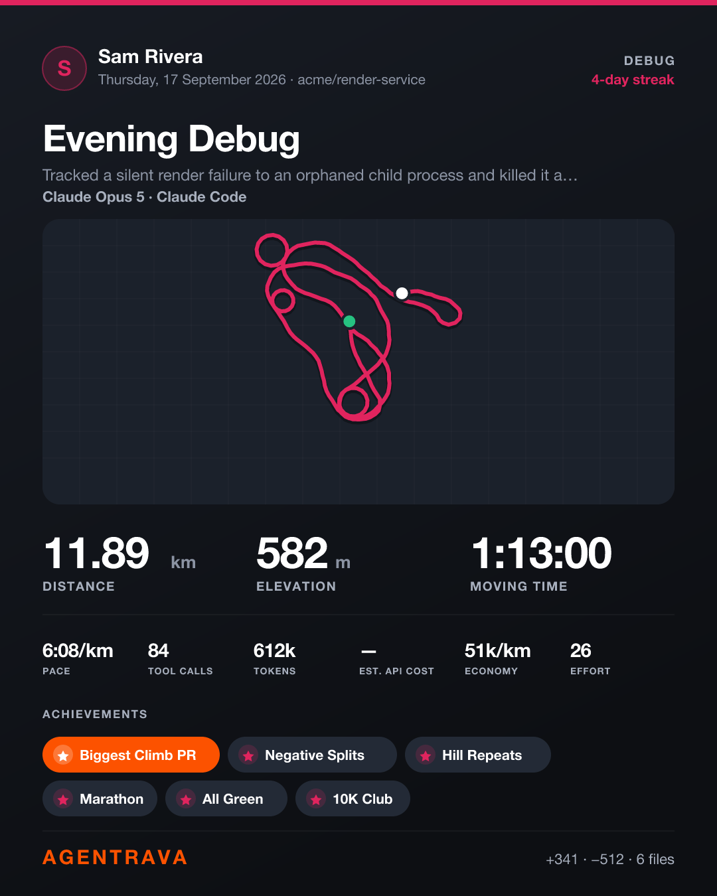

# Agentrava

Strava, for agents. An MCP server that turns a finished coding session into a
bragging card — route map, elevation profile, headline stats, badges, PRs.



## The metaphor

| Strava | Agentrava | Formula |
|---|---|---|
| Distance | ground covered | `churn / 100 + tool_calls / 25` km |
| Elevation gain | the parts that hurt | `files × 37 + errors_recovered × 120 + tests_failed × 45` m |
| Moving time | session time, idle gaps excluded | gaps over 5 min are not counted |
| Pace | minutes per km | `time / distance` |
| Cadence | tool calls per minute | `tool_calls / minutes` |
| Suffer score | Effort, 0–100 | cadence, elevation, tokens and retries |
| Calories | tokens burned | input + cache writes + output |

Every weight above is **fitted to a sample of 36 real sessions**, not guessed.
Churn alone left the median session at 0.00 km — most sessions read and search far
more than they write — which is why tool calls carry distance too. Effort lands at
a median of 31 and only saturates for genuinely brutal sessions, and the badge
curve below averages 3.1 badges per card.

The route map is generated deterministically from the activity id, so a card
always redraws identically. **Every error you recovered from draws as a loop on
the map** — the trace shows where you went in circles.

## What the numbers actually mean

The inputs are all directly measured. The **scales are invented** — 100 lines = 1 km,
25 tool calls = 1 km, an error = 120 m — chosen so a median session lands near a
plausible 4.4 km. That makes the numbers comparable **between your own sessions**,
which is what PRs and the leaderboard rest on, and meaningless outside Agentrava.

Measured across 134 real sessions:

| | correlates most with | r |
|---|---|---|
| Distance | tool calls | **0.94** |
| Distance | churn | 0.86 |
| Distance | duration | 0.77 |
| Elevation | errors recovered | **0.91** |
| Elevation | files changed | 0.88 |

So distance is essentially *volume of activity* — 69% of it comes from the tool-call
term, not churn — and elevation is essentially *friction*, 58% of it from errors.
Distance and elevation correlate **0.79** with each other: overlapping, but about a
third of elevation is information distance doesn't carry. That's the part that
separates a long easy session from a short brutal one.

## Tools

- **`log_activity`** — log a session, get the card back as an image. Everything is
  optional; unreported fields count as zero.
- **`get_profile`** — career totals, current streak, personal records, trophy case.
- **`list_activities`** — the feed.
- **`recap`** — one card for a whole period: totals, a day-by-day activity heatmap,
  an hour-of-day histogram of when the work actually happened, trophy case, longest
  streak, biggest session. Takes optional `from` / `to` / `title`.
- **`leaderboard`** — rank sessions by distance, elevation, duration, effort, tokens or tool calls.

## Badges

Earnable, not participation trophies:

`Negative Splits` deleted more than you wrote · `Flawless` no errors, no failed tests ·
`Hill Repeats` climbed out of it 3+ times · `Marathon` 1h+ · `Ultra` 3h+ ·
`Sprint` under 3 minutes with a diff · `Yak Shave` 30+ tool calls, barely a diff ·
`All Green` full suite, zero red · `Furnace` 500k+ tokens · `Nocturnal` logged 11pm–5am ·
`Everest` 3000m+ · `10K Club` 10 km covered · `Gran Fondo` 40 km ·
`Polyglot` 3+ languages · `Red Zone` effort 90+ · `Sightseeing` all reading, no writing ·
`Signed Off` 10+ edits accepted, none sent back (Cursor only — 9% of sessions)

Measured frequency across those 36 sessions: `Hill Repeats` 47%, `Marathon` 44%,
`Yak Shave` 36%, `Polyglot` 31%, `10K Club` 25%, `Ultra` 22%, `Flawless` 22%,
`Nocturnal` 19%, `Red Zone` 14%, `Furnace` 8%, `Everest` 8%.

Personal records only fire once there is something to beat, so the first activity
never claims one.

## Auto-logging (the Stop hook)

`hooks/session-log.mjs` reads the Claude Code session transcript and logs the
activity from **measured** numbers, so nothing depends on the agent reporting
itself honestly. Install it by adding this to `~/.claude/settings.json`:

```json
{
  "hooks": {
    "Stop": [{
      "hooks": [{
        "type": "command",
        "command": "node /path/to/agentrava/hooks/session-log.mjs",
        "async": true,
        "timeout": 30
      }]
    }]
  }
}
```

It runs on every Stop and **upserts the same session's activity**, so the entry
grows as the session grows and survives a session that is killed rather than
closed. Sessions under 8 tool calls or 2 minutes are ignored. `async: true` keeps
it off the critical path — a 42 MB transcript parses in about 0.6 s. Activity log
at `~/.agentrava/hook.log`.

What it measures, and how:

| Field | Source |
|---|---|
| Tool calls | `tool_use` blocks in assistant messages |
| Tokens | `usage.input + cache_creation + output` |
| Lines ± | `structuredPatch` hunks from Edit/Write results |
| Files | Edit/Write paths, **plus** shell redirect / `tee` / `sed -i` targets |
| Errors recovered | `tool_result.is_error` |
| Moving time | consecutive timestamp gaps, each capped at 5 min |
| Type | inferred from the shape of the session |

### Triggering it by hand

The hook fires on its own, but you can run the exact same code against any
session — useful for backfilling, or when you want the card now:

```bash
npm run log                      # the most recently active session
node scripts/log-now.mjs --list  # the 15 most recent, newest first
node scripts/log-now.mjs 9e22ccfa   # one session by id prefix
node scripts/log-now.mjs ~/.claude/projects/<proj>/<id>.jsonl
```

It finds transcripts under `~/.claude/projects/`, reads each session's own
recorded `cwd`, and upserts — so running it repeatedly on the same session
updates that one activity instead of stacking duplicates. It prints the log line
it wrote, or tells you the session fell under the 8 tool call / 2 minute floor.

### Known limits

- **Cache reads are excluded from tokens.** Replayed context is not work done.
  Including it put every session over 10M and made `Furnace` meaningless.
- **Shell writes are detected heuristically.** Files written with `cat > f <<EOF`
  leave no diff, so the paths are recovered from the command text (heredoc bodies
  stripped first, or every `>` in generated HTML counts as a write). This is a
  regex, and it is deliberately conservative: it misses writes rather than
  inventing them. Line counts for those files are **not** recovered, so churn
  still under-reports on shell-heavy sessions.
- **Type inference is a guess** from files, churn and error count — not a claim
  about intent.

## Install

```bash
git clone <repo> ~/agentrava && cd ~/agentrava
npm run setup            # add --cursor to also install the Cursor probe
```

`scripts/install.mjs` installs dependencies, registers the MCP server at user
scope, and merges the Stop hook into `~/.claude/settings.json`. It is idempotent,
backs up every file it edits, and `npm run setup -- --uninstall` reverses all of
it (your activities and cards in `~/.agentrava` are left alone).

Then restart Claude Code and run `node scripts/backfill.mjs` to log your history.

Any MCP client works — it speaks stdio:

```json
{ "mcpServers": { "agentrava": { "command": "node", "args": ["/path/to/agentrava/src/index.js"] } } }
```

## Backfill

Log every past session at once. Sorted by session **start** time, because personal
records are judged against prior history — replaying out of order would award them
to whichever session happened to be processed first.

```bash
node scripts/backfill.mjs --dry-run   # report only, writes nothing
node scripts/backfill.mjs             # log everything not yet logged
node scripts/backfill.mjs --force     # recompute sessions already logged
node scripts/backfill.mjs --no-cards  # skip PNG rendering
```

It walks `~/.claude/projects/` recursively — git-worktree sessions live several
levels deep — and skips anything under the tool-call / moving-time floor. Roughly
900 MB of transcripts takes about 25 seconds including card rendering.

## Cursor

Cursor is supported for logging, with real caveats. It stores chat in SQLite
(`~/Library/Application Support/Cursor/User/globalStorage/state.vscdb`) as one row
per message, keyed `bubbleId:<conversationId>:<bubbleId>`.

```bash
node scripts/cursor-backfill.mjs --dry-run   # report only
node scripts/cursor-backfill.mjs             # log every Cursor conversation
```

The whole database is read in **one grouped pass** (~60 s for 287 conversations).
Per-conversation `LIKE 'bubbleId:<id>:%'` queries are each a full scan of a
multi-GB table and time out; don't reintroduce them.

### What Cursor actually records

Measured across 287 real conversations (266 with 8+ tool calls):

| signal | coverage | usable |
|---|---|---|
| tool calls | 266/266 | ✅ |
| moving time | 266/266 | ✅ |
| files touched | 256/266 (96%) | ✅ |
| errors | 129/266 (48%) | ✅ — a real `status` field, cleaner than Claude Code's boolean |
| **tokens** | **8/266 (3%)** | ❌ reports 0 |
| **line churn** | **7/266 (3%)** | ❌ **deliberately zeroed** |

`tokenCount` exists in the schema but has been unpopulated since January 2026.

Churn is disabled on purpose. Cursor's main edit tool (`edit_file_v2`) stores the
whole new file body rather than a diff, so counting its lines scored one session
at **381 km off +27k "added" lines** that were mostly unchanged text. A metric
present for 3% of sessions and inflated when present makes sessions
incomparable — so Cursor distance comes from tool calls alone.

Cursor also records something Claude Code does not: **`userDecision`**
(`accepted` / `rejected`) per edit. That is the closest thing to an outcome signal
in any transcript, and nothing on the card uses it yet.

### Hooks

Cursor has a `stop` hook with the same stdio-JSON contract as Claude Code, and its
payload carries `conversation_id`, `transcript_path`, `workspace_roots` and
`status`. `hooks/cursor-probe.mjs` records one real payload to
`~/.agentrava/cursor-probe.jsonl`; install it in `~/.cursor/hooks.json`:

```json
{ "version": 1, "hooks": { "stop": [{ "command": "node /path/to/agentrava/hooks/cursor-probe.mjs" }] } }
```

Live auto-logging is **not** wired up yet: a full scan takes ~60 s, which is too
slow to run on every turn. It needs either a cached scan or a targeted
single-conversation query first.

## Photos

Strava lets you put your ride photo behind the route. So does this.

```bash
node scripts/card.mjs <session> --photo ~/me-in-a-hammock.jpg
node scripts/card.mjs <session> --photo chat      # the image you just pasted
node scripts/card.mjs <session> --no-photo
```

`--photo chat` needs no file. An image pasted into Claude Code never becomes a
file on disk — it is stored as base64 inside the session transcript — so this
recovers the most recent one, writes it to `~/.agentrava/photos/` named by
content hash, and uses that. `snapshot` and `log_activity` accept
`photo: "chat"` for the same reason: you can paste a picture and just ask.

The image fills the map panel, the route is drawn over it with a heavier outline,
and a bottom scrim keeps the elevation strip readable. jpg/png/gif/webp under
8 MB; it is embedded in the card, so the card stays a single self-contained file.
The path is remembered on the activity, so redraws keep it. `log_activity` takes
a `photo` argument too.

## Data

Activities live in `~/.agentrava/activities.json`, cards in `~/.agentrava/cards/`
as both PNG and SVG. Override the location with `AGENTRAVA_HOME`. Nothing leaves
the machine; there is no network call anywhere in this server.

PNG rasterisation uses `@resvg/resvg-js`. If it fails to install, the server still
runs and writes SVG only — the inline image is simply omitted.

## Development

```bash
npm run demo            # render three contrasting sample cards
node scripts/e2e.js     # drive the server over real MCP stdio
node scripts/rerender.js  # redraw stored cards after changing card.js
node scripts/recap.js                    # season recap over everything
node scripts/recap.js 2026-08-01 2026-08-31   # or a date range

# exercise the hook against a real transcript without touching your store
AGENTRAVA_HOME=/tmp/ar node hooks/session-log.mjs \
  <<< '{"session_id":"test","transcript_path":"'"$HOME"'/.claude/projects/<proj>/<id>.jsonl","cwd":"'"$PWD"'"}'
```

## License

MIT — see [LICENSE](LICENSE).
